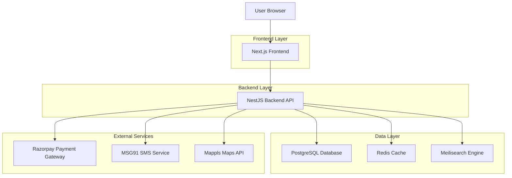
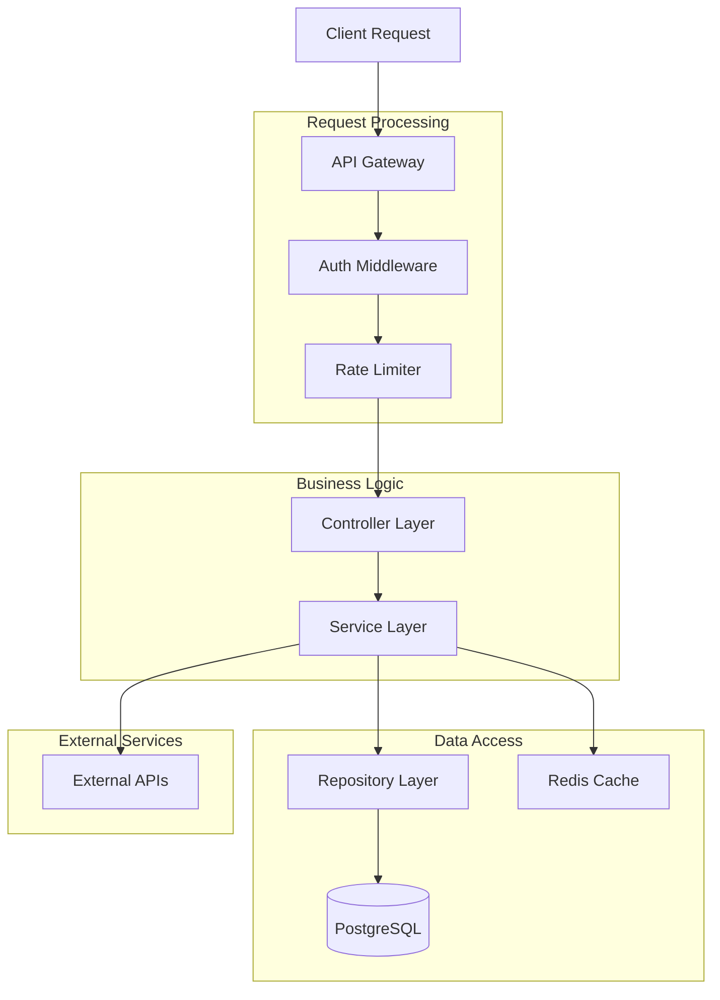
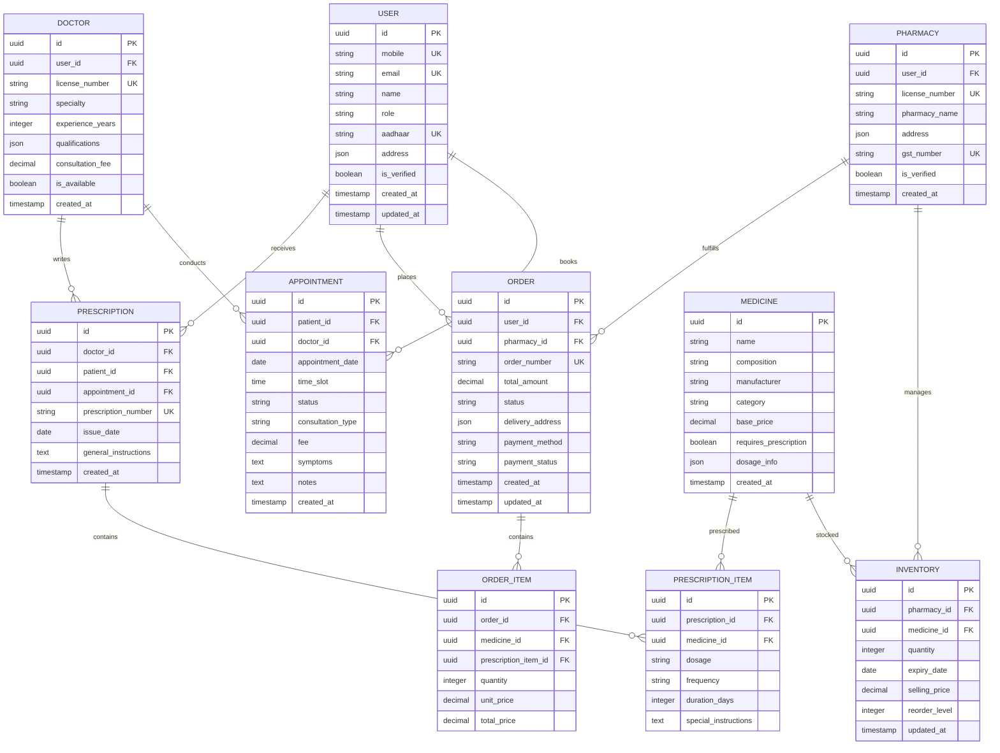

## 1. Architecture design



## 2. Technology Description

* **Frontend**: Next.js\@14 + React\@18 + TypeScript\@5 + Tailwind CSS\@3

* **Initialization Tool**: create-next-app

* **Backend**: NestJS\@10 + Node.js\@20 + TypeScript\@5

* **Database**: PostgreSQL\@15 (primary), Redis\@7 (cache), Meilisearch\@1 (search)

* **ORM**: Prisma\@5 for PostgreSQL, ioredis\@5 for Redis

* **Authentication**: JWT with refresh tokens, role-based access control

* **File Storage**: AWS S3 with CloudFront CDN

* **Message Queue**: Redis Bull Queue for background jobs

* **Monitoring**: Prometheus + Grafana for metrics, Sentry for error tracking

## 3. Route definitions

| Route                 | Purpose                                               |
| --------------------- | ----------------------------------------------------- |
| /                     | Home page with medicine search and featured services  |
| /auth/login           | User authentication with mobile OTP                   |
| /auth/register        | User registration with role selection                 |
| /patient/dashboard    | Patient dashboard with appointments and prescriptions |
| /patient/medicines    | Medicine search and ordering interface                |
| /patient/appointments | Appointment booking and management                    |
| /doctor/dashboard     | Doctor dashboard with schedule and patients           |
| /doctor/prescriptions | E-prescription creation and management                |
| /doctor/schedule      | Availability and calendar management                  |
| /pharmacy/dashboard   | Pharmacy inventory and order management               |
| /pharmacy/inventory   | Medicine stock management with expiry tracking        |
| /pharmacy/billing     | GST-compliant billing and invoice generation          |
| /diagnostic/dashboard | Diagnostic center management interface                |
| /diagnostic/tests     | Test package creation and pricing                     |
| /diagnostic/reports   | Report upload and management                          |
| /admin/dashboard      | Platform analytics and user management                |
| /admin/analytics      | Revenue and usage analytics                           |
| /admin/compliance     | DPDP Act compliance monitoring                        |
| /payment/checkout     | Payment processing with multiple options              |
| /payment/history      | Transaction history and refunds                       |
| /profile/settings     | User profile and preference management                |

## 4. API definitions

### 4.1 Authentication APIs

**POST /api/auth/login**

Request:

| Param Name | Param Type | isRequired | Description                                    |
| ---------- | ---------- | ---------- | ---------------------------------------------- |
| mobile     | string     | true       | 10-digit mobile number                         |
| otp        | string     | true       | 6-digit OTP code                               |
| role       | string     | true       | User role (patient/doctor/pharmacy/diagnostic) |

Response:

| Param Name     | Param Type | Description                |
| -------------- | ---------- | -------------------------- |
| access\_token  | string     | JWT access token           |
| refresh\_token | string     | JWT refresh token          |
| user           | object     | User profile data          |
| role           | string     | User role with permissions |

Example:

```json
{
  "mobile": "9876543210",
  "otp": "123456",
  "role": "patient"
}
```

**POST /api/auth/register**

Request:

| Param Name      | Param Type | isRequired  | Description                     |
| --------------- | ---------- | ----------- | ------------------------------- |
| mobile          | string     | true        | 10-digit mobile number          |
| email           | string     | true        | Valid email address             |
| name            | string     | true        | Full name                       |
| role            | string     | true        | User role selection             |
| aadhaar         | string     | conditional | Required for patients           |
| license\_number | string     | conditional | Required for doctors/pharmacies |

### 4.2 Medicine APIs

**GET /api/medicines/search**

Request Query Parameters:

| Param Name | Param Type | isRequired | Description                     |
| ---------- | ---------- | ---------- | ------------------------------- |
| query      | string     | true       | Search query (name/composition) |
| location   | string     | false      | User location for availability  |
| page       | number     | false      | Pagination page number          |
| limit      | number     | false      | Results per page (default: 20)  |

**POST /api/medicines/order**

Request:

| Param Name        | Param Type | isRequired  | Description                         |
| ----------------- | ---------- | ----------- | ----------------------------------- |
| items             | array      | true        | Array of medicine items             |
| prescription\_id  | string     | conditional | Required for prescription medicines |
| delivery\_address | object     | true        | Delivery address details            |
| payment\_method   | string     | true        | Payment method selection            |

### 4.3 Appointment APIs

**POST /api/appointments/book**

Request:

| Param Name         | Param Type | isRequired | Description                   |
| ------------------ | ---------- | ---------- | ----------------------------- |
| doctor\_id         | string     | true       | Doctor unique identifier      |
| date               | string     | true       | Appointment date (YYYY-MM-DD) |
| time\_slot         | string     | true       | Time slot selection           |
| consultation\_type | string     | true       | online/offline                |
| symptoms           | string     | false      | Patient symptoms description  |

**GET /api/appointments/schedule/:doctor\_id**

Response:

| Param Name       | Param Type | Description                            |
| ---------------- | ---------- | -------------------------------------- |
| available\_slots | array      | Available time slots for selected date |
| booked\_slots    | array      | Already booked time slots              |
| doctor\_fee      | number     | Consultation fee amount                |

### 4.4 Payment APIs

**POST /api/payments/create-order**

Request:

| Param Name        | Param Type | isRequired | Description                          |
| ----------------- | ---------- | ---------- | ------------------------------------ |
| amount            | number     | true       | Payment amount in INR                |
| currency          | string     | true       | Currency code (INR)                  |
| order\_type       | string     | true       | Type of order (medicine/appointment) |
| customer\_details | object     | true       | Customer information                 |

**POST /api/payments/verify**

Request:

| Param Name            | Param Type | isRequired | Description                        |
| --------------------- | ---------- | ---------- | ---------------------------------- |
| razorpay\_order\_id   | string     | true       | Razorpay order ID                  |
| razorpay\_payment\_id | string     | true       | Razorpay payment ID                |
| razorpay\_signature   | string     | true       | Payment signature for verification |

## 5. Server architecture diagram



## 6. Data model

### 6.1 Data model definition



### 6.2 Data Definition Language

**Users Table**

```sql
CREATE TABLE users (
    id UUID PRIMARY KEY DEFAULT gen_random_uuid(),
    mobile VARCHAR(10) UNIQUE NOT NULL,
    email VARCHAR(255) UNIQUE NOT NULL,
    name VARCHAR(100) NOT NULL,
    role VARCHAR(20) NOT NULL CHECK (role IN ('patient', 'doctor', 'pharmacy', 'diagnostic', 'admin')),
    aadhaar VARCHAR(12) UNIQUE,
    address JSONB,
    is_verified BOOLEAN DEFAULT FALSE,
    created_at TIMESTAMP WITH TIME ZONE DEFAULT NOW(),
    updated_at TIMESTAMP WITH TIME ZONE DEFAULT NOW()
);

CREATE INDEX idx_users_mobile ON users(mobile);
CREATE INDEX idx_users_role ON users(role);
CREATE INDEX idx_users_verified ON users(is_verified);
```

**Doctors Table**

```sql
CREATE TABLE doctors (
    id UUID PRIMARY KEY DEFAULT gen_random_uuid(),
    user_id UUID UNIQUE REFERENCES users(id) ON DELETE CASCADE,
    license_number VARCHAR(50) UNIQUE NOT NULL,
    specialty VARCHAR(100) NOT NULL,
    experience_years INTEGER CHECK (experience_years >= 0),
    qualifications JSONB,
    consultation_fee DECIMAL(10,2) DEFAULT 0.00,
    is_available BOOLEAN DEFAULT TRUE,
    created_at TIMESTAMP WITH TIME ZONE DEFAULT NOW()
);

CREATE INDEX idx_doctors_specialty ON doctors(specialty);
CREATE INDEX idx_doctors_available ON doctors(is_available);
```

**Medicines Table**

```sql
CREATE TABLE medicines (
    id UUID PRIMARY KEY DEFAULT gen_random_uuid(),
    name VARCHAR(255) NOT NULL,
    composition TEXT NOT NULL,
    manufacturer VARCHAR(255),
    category VARCHAR(100),
    base_price DECIMAL(10,2) DEFAULT 0.00,
    requires_prescription BOOLEAN DEFAULT FALSE,
    dosage_info JSONB,
    created_at TIMESTAMP WITH TIME ZONE DEFAULT NOW()
);

CREATE INDEX idx_medicines_name ON medicines(name);
CREATE INDEX idx_medicines_composition ON medicines USING GIN(to_tsvector('english', composition));
CREATE INDEX idx_medicines_category ON medicines(category);
```

**Appointments Table**

```sql
CREATE TABLE appointments (
    id UUID PRIMARY KEY DEFAULT gen_random_uuid(),
    patient_id UUID REFERENCES users(id) ON DELETE CASCADE,
    doctor_id UUID REFERENCES doctors(id) ON DELETE CASCADE,
    appointment_date DATE NOT NULL,
    time_slot TIME NOT NULL,
    status VARCHAR(20) DEFAULT 'scheduled' CHECK (status IN ('scheduled', 'completed', 'cancelled', 'no-show')),
    consultation_type VARCHAR(20) CHECK (consultation_type IN ('online', 'offline')),
    fee DECIMAL(10,2) DEFAULT 0.00,
    symptoms TEXT,
    notes TEXT,
    created_at TIMESTAMP WITH TIME ZONE DEFAULT NOW(),
    UNIQUE(doctor_id, appointment_date, time_slot)
);

CREATE INDEX idx_appointments_patient ON appointments(patient_id);
CREATE INDEX idx_appointments_doctor ON appointments(doctor_id);
CREATE INDEX idx_appointments_date ON appointments(appointment_date);
```

**Orders Table**

```sql
CREATE TABLE orders (
    id UUID PRIMARY KEY DEFAULT gen_random_uuid(),
    user_id UUID REFERENCES users(id) ON DELETE CASCADE,
    pharmacy_id UUID REFERENCES pharmacies(id) ON DELETE CASCADE,
    order_number VARCHAR(20) UNIQUE NOT NULL,
    total_amount DECIMAL(10,2) NOT NULL,
    status VARCHAR(20) DEFAULT 'pending' CHECK (status IN ('pending', 'confirmed', 'processing', 'shipped', 'delivered', 'cancelled')),
    delivery_address JSONB NOT NULL,
    payment_method VARCHAR(50),
    payment_status VARCHAR(20) DEFAULT 'pending',
    created_at TIMESTAMP WITH TIME ZONE DEFAULT NOW(),
    updated_at TIMESTAMP WITH TIME ZONE DEFAULT NOW()
);

CREATE INDEX idx_orders_user ON orders(user_id);
CREATE INDEX idx_orders_pharmacy ON orders(pharmacy_id);
CREATE INDEX idx_orders_status ON orders(status);
CREATE INDEX idx_orders_created ON orders(created_at DESC);
```

**Prescriptions Table**

```sql
CREATE TABLE prescriptions (
    id UUID PRIMARY KEY DEFAULT gen_random_uuid(),
    doctor_id UUID REFERENCES doctors(id) ON DELETE CASCADE,
    patient_id UUID REFERENCES users(id) ON DELETE CASCADE,
    appointment_id UUID REFERENCES appointments(id) ON DELETE SET NULL,
    prescription_number VARCHAR(20) UNIQUE NOT NULL,
    issue_date DATE NOT NULL DEFAULT CURRENT_DATE,
    general_instructions TEXT,
    created_at TIMESTAMP WITH TIME ZONE DEFAULT NOW()
);

CREATE INDEX idx_prescriptions_patient ON prescriptions(patient_id);
CREATE INDEX idx_prescriptions_doctor ON prescriptions(doctor_id);
CREATE INDEX idx_prescriptions_date ON prescriptions(issue_date DESC);
```

**Audit Log Table (for DPDP Compliance)**

```sql
CREATE TABLE audit_logs (
    id UUID PRIMARY KEY DEFAULT gen_random_uuid(),
    user_id UUID REFERENCES users(id) ON DELETE SET NULL,
    action VARCHAR(100) NOT NULL,
    resource_type VARCHAR(50) NOT NULL,
    resource_id UUID,
    ip_address INET,
    user_agent TEXT,
    metadata JSONB,
    created_at TIMESTAMP WITH TIME ZONE DEFAULT NOW()
);

CREATE INDEX idx_audit_user ON audit_logs(user_id);
CREATE INDEX idx_audit_action ON audit_logs(action);
CREATE INDEX idx_audit_created ON audit_logs(created_at DESC);
```

