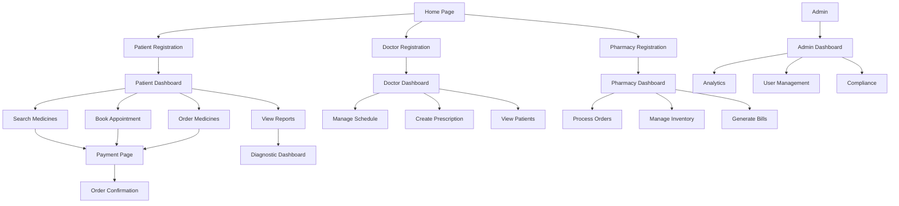

## 1. Product Overview

A comprehensive Indian healthcare platform connecting patients, doctors, pharmacists, and diagnostic centers to streamline healthcare delivery and medicine access across India. The platform solves healthcare accessibility challenges by providing a unified digital ecosystem for medical consultations, prescriptions, medicine ordering, and diagnostic services.

Target market: Urban and semi-urban Indian population seeking convenient healthcare services, with focus on tier-2 and tier-3 cities where healthcare infrastructure is limited.

## 2. Core Features

### 2.1 User Roles

| Role | Registration Method | Core Permissions |
|------|---------------------|------------------|
| Patient | Mobile OTP + Aadhaar verification | Search medicines, book appointments, order prescriptions, make payments, view medical history |
| Doctor | Medical license verification + KYC | Create e-prescriptions, manage schedule, view patient history, conduct consultations |
| Pharmacist | Pharmacy license verification | Manage inventory, process orders, generate GST bills, track deliveries |
| Diagnostic Center | Lab license verification | Upload reports, manage test packages, schedule sample collection |
| Admin | Internal invitation only | Platform analytics, user management, content moderation, compliance oversight |

### 2.2 Feature Module

Our healthcare platform consists of the following main pages:

1. **Home page**: Medicine search, featured services, quick appointment booking, health tips
2. **Patient dashboard**: Appointment history, prescriptions, medicine orders, test reports, payment history
3. **Doctor dashboard**: Schedule management, patient queue, e-prescription interface, consultation history
4. **Pharmacy dashboard**: Inventory management, order processing, GST billing, delivery tracking
5. **Diagnostic dashboard**: Test packages, report upload, sample collection scheduling
6. **Search results page**: Medicine availability, price comparison, store locations
7. **Appointment booking page**: Doctor selection, time slot booking, consultation type (online/offline)
8. **Prescription page**: Digital prescription viewer, medicine ordering, dosage reminders
9. **Payment page**: UPI integration, card payments, wallet options, insurance claims
10. **Admin dashboard**: Platform analytics, user management, compliance reports, revenue tracking

### 2.3 Page Details

| Page Name | Module Name | Feature description |
|-----------|-------------|---------------------|
| Home page | Medicine search | Search medicines by name, composition, or brand with auto-suggestions and voice input support |
| Home page | Featured services | Display carousel of available services: online consultations, medicine delivery, lab tests |
| Home page | Quick appointment | Book doctor appointments with specialty filters, location-based search, and instant booking |
| Patient dashboard | Appointment history | View past and upcoming appointments with doctor details, consultation notes, and follow-up reminders |
| Patient dashboard | Prescription manager | Access all digital prescriptions, reorder medicines, set dosage reminders, track order status |
| Patient dashboard | Medicine orders | Browse order history, track deliveries, manage subscriptions for chronic medications |
| Doctor dashboard | Schedule management | Set available time slots, manage leave calendar, block emergency slots, sync with personal calendar |
| Doctor dashboard | Patient queue | View waiting patients, access medical history, update consultation status, write digital notes |
| Doctor dashboard | E-prescription | Create digital prescriptions with medicine database integration, dosage calculator, drug interaction warnings |
| Pharmacy dashboard | Inventory management | Track stock levels, set reorder alerts, manage expiry dates, handle returns and replacements |
| Pharmacy dashboard | Order processing | Receive and process medicine orders, verify prescriptions, pack and dispatch items |
| Pharmacy dashboard | GST billing | Generate GST-compliant invoices, manage tax calculations, file returns, maintain compliance records |
| Diagnostic dashboard | Test packages | Create and manage diagnostic test packages, set pricing, define sample requirements |
| Diagnostic dashboard | Report management | Upload digital reports, notify patients, maintain report history, integrate with doctor prescriptions |
| Search results page | Medicine comparison | Compare prices across pharmacies, check availability, view alternative brands, filter by location |
| Appointment booking | Doctor selection | Filter by specialty, experience, consultation fee, location, availability, patient ratings |
| Payment page | UPI integration | Support all major UPI apps, generate QR codes, handle payment failures, provide instant refunds |
| Payment page | Insurance processing | Verify insurance coverage, process cashless claims, handle reimbursement documentation |
| Admin dashboard | Platform analytics | Monitor user registrations, order volumes, revenue trends, popular services, geographic distribution |
| Admin dashboard | Compliance management | Track DPDP Act compliance, audit user data access, manage consent records, handle data requests |

## 3. Core Process

### Patient Flow
Patients begin by registering with mobile number and Aadhaar verification. They can search for medicines, browse doctors by specialty, book appointments, and order prescribed medicines. The platform provides end-to-end healthcare services from consultation to medicine delivery.

### Doctor Flow
Doctors register with medical license verification, set their availability schedule, and manage patient consultations. They can create digital prescriptions, view patient medical history, and conduct both online and offline consultations with integrated payment processing.

### Pharmacy Flow
Pharmacies manage their inventory, process incoming medicine orders, generate GST-compliant bills, and coordinate medicine deliveries. They receive prescription verification requests and maintain compliance with pharmaceutical regulations.

### Diagnostic Center Flow
Diagnostic centers offer test packages, schedule sample collections, upload digital reports, and integrate with doctor prescriptions for seamless patient experience.

### Admin Flow
Administrators monitor platform performance, manage user accounts, ensure DPDP Act compliance, analyze revenue metrics, and maintain platform security and reliability.

## 4. User Interface Design

### 4.1 Design Style
- **Primary colors**: Healthcare blue (#2196F3), Trust white (#FFFFFF), Professional grey (#757575)
- **Secondary colors**: Success green (#4CAF50), Warning orange (#FF9800), Error red (#F44336)
- **Button style**: Rounded corners with subtle shadows, primary actions in blue, secondary in outlined style
- **Font**: Inter for headings, Roboto for body text, Noto Sans for Hindi/regional language support
- **Layout style**: Card-based design with clear visual hierarchy, consistent spacing using 8px grid system
- **Icons**: Material Design icons with healthcare-specific custom icons for medicines, prescriptions, appointments

### 4.2 Page Design Overview

| Page Name | Module Name | UI Elements |
|-----------|-------------|-------------|
| Home page | Medicine search | Prominent search bar with voice input icon, auto-suggestion dropdown, search filters in collapsible sidebar |
| Home page | Featured services | Horizontal card carousel with service icons, quick action buttons, promotional banners with gradient backgrounds |
| Patient dashboard | Appointment history | Timeline view with status indicators, color-coded appointment types, quick action buttons for each appointment |
| Doctor dashboard | Schedule management | Weekly calendar grid with time slots, drag-and-drop appointment rescheduling, color-coded availability status |
| Pharmacy dashboard | Inventory management | Data table with search and filters, stock level progress bars, expiry date warnings with red highlighting |
| Payment page | UPI integration | Large QR code display, UPI ID input field, supported apps grid, transaction status with real-time updates |
| Admin dashboard | Analytics | Interactive charts with hover details, KPI cards with trend indicators, geographic heat maps for service usage |

### 4.3 Responsiveness
Desktop-first design approach with mobile adaptation. Touch interaction optimization for tablet devices used in healthcare settings. Responsive breakpoints: 320px (mobile), 768px (tablet), 1024px (desktop), 1440px (large desktop). Medical interfaces prioritize readability with minimum 16px font sizes for critical information.

### 4.4 Accessibility Features
WCAG 2.1 AA compliance with high contrast mode support, screen reader optimization, keyboard navigation for medical professionals, and Hindi/regional language toggle. Medical terms include pronunciation guides and simplified explanations for patient education.